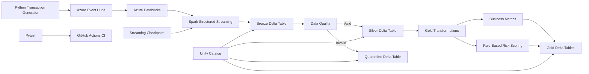

# Real-Time Financial Transaction Lakehouse

A production-style data engineering portfolio project demonstrating real-time financial transaction ingestion, stream processing, Medallion Architecture, data-quality validation, analytics, rule-based risk scoring, monitoring, automated testing, CI/CD, and Azure cloud deployment.

The project simulates a financial transaction platform for the fictional company **NovaPay Financial**.

---

## Project Overview

Modern financial platforms generate large volumes of transaction events that must be processed reliably while preventing invalid or duplicate data from reaching downstream analytics.

This project implements the pipeline in two environments:

### Local Development Architecture

**Python → Apache Kafka → Spark Structured Streaming → Bronze → Data Quality → Silver / Quarantine → Gold Analytics → Risk Scoring → Monitoring**

### Azure Cloud Architecture

**Python → Azure Event Hubs → Azure Databricks Serverless → Spark Structured Streaming → Delta Lake / Unity Catalog → Bronze → Data Quality → Silver / Quarantine → Gold Analytics**

The project demonstrates event streaming, schema enforcement, data-quality controls, deduplication, Medallion Architecture, analytical transformations, secure cloud connectivity, streaming checkpointing, monitoring, automated testing, and CI/CD.

---

## Architecture



The project was first developed locally using Apache Kafka, Docker, and Spark and was subsequently deployed to Azure using Azure Event Hubs and Azure Databricks.

Detailed architecture documentation is available in:

`architecture/architecture.md`

---

## Technology Stack

| Category | Technology |
|---|---|
| Programming | Python |
| Local Event Streaming | Apache Kafka |
| Cloud Event Streaming | Azure Event Hubs |
| Stream Processing | Apache Spark Structured Streaming |
| Data Processing | PySpark |
| Cloud Compute | Azure Databricks Serverless |
| Cloud Storage Format | Delta Lake |
| Local Storage Format | Apache Parquet |
| Data Governance / Catalog | Unity Catalog |
| Architecture | Medallion Architecture |
| Data Layers | Bronze, Silver, Gold, Quarantine |
| Containerization | Docker / Docker Compose |
| Data Quality | PySpark validation rules |
| Testing | Pytest |
| Monitoring | Python + Spark |
| CI/CD | GitHub Actions |
| Version Control | Git / GitHub |
| Development | VS Code, WSL |

---

## Pipeline Flow

### 1. Synthetic Transaction Generation

The Python transaction generator creates realistic simulated financial transaction events containing:

- Transaction ID
- Customer ID
- Account ID
- Merchant ID
- Merchant category
- Transaction type
- Amount
- Currency
- Payment method
- Country
- City
- Device type
- Transaction status
- Event timestamp

The generator intentionally introduces bad records and duplicate transaction IDs so downstream data-quality controls can be tested.

Generated dataset:

```text
1,000 base transactions
+   10 duplicate records
-----------------------
1,010 total records
```

---

## 2. Local Apache Kafka Streaming

For local development, transactions are published to the Kafka topic:

```text
financial-transactions
```

The topic uses three partitions.

Measured local Kafka results:

```text
Messages published: 1,010
Successful:         1,010
Failed:                 0
Throughput:        496.75 messages/sec
```

Kafka provides the local event-streaming layer between transaction generation and Spark processing.

---

## 3. Azure Event Hubs Deployment

The cloud implementation uses **Azure Event Hubs** as the managed event-ingestion service.

Event Hub:

```text
financial-transactions
```

Configuration:

```text
Partitions: 3
Kafka-compatible endpoint: Enabled
```

A Python producer using the Azure Event Hubs SDK publishes the same simulated transaction events to Azure.

Verified cloud ingestion:

```text
Transactions loaded:       1,010
Successful events:         1,010
Failed events:                 0
Producer throughput:      439.76 events/sec
```

Azure Event Hubs metrics confirmed approximately **1.01K incoming messages**.

Producer credentials are supplied through an environment variable rather than stored in source code.

---

## 4. Spark Structured Streaming

Spark Structured Streaming consumes transaction events from the streaming source.

The pipeline captures transaction data along with streaming metadata including:

- Partition
- Offset
- Source timestamp
- Ingestion timestamp

This provides traceability between source events and lakehouse records.

The local implementation consumes from Apache Kafka, while the Azure implementation consumes from the Kafka-compatible Azure Event Hubs endpoint using Azure Databricks.

The cloud streaming implementation was validated using a bounded `availableNow` trigger and persisted the streaming checkpoint in a Unity Catalog Volume.

Verified Azure Structured Streaming records:

```text
1,010
```

---

## 5. Bronze Layer

The Bronze layer stores incoming transaction events with minimal transformation.

### Local Bronze

Local Bronze data is persisted using Apache Parquet.

### Azure Bronze

The Azure implementation persists Bronze data as managed Delta tables in Azure Databricks and Unity Catalog.

Verified results:

```text
Bronze batch records:       1,010
Bronze streaming records:   1,010
```

Raw transaction values and ingestion metadata are retained so data-quality issues can be identified downstream.

---

## 6. Data Quality

The data-quality pipeline validates transactions before they enter the trusted Silver layer.

Validation includes checks for:

- Missing transaction IDs
- Missing customer IDs
- Missing amounts
- Non-positive amounts
- Invalid currencies
- Invalid statuses
- Missing or invalid timestamps
- Duplicate transaction IDs

Invalid records are separated from trusted records rather than silently discarded.

Duplicate removal is performed on valid transactions before writing the final Silver dataset.

---

## 7. Silver and Quarantine Layers

Records passing validation are standardized and deduplicated before being written to Silver.

Invalid records are written separately to the Quarantine layer with validation information.

Verified local and Azure processing results:

| Metric | Result |
|---|---:|
| Bronze records | 1,010 |
| Valid before deduplication | 959 |
| Invalid / quarantined | 51 |
| Valid duplicates removed | 9 |
| Final Silver records | 950 |
| Silver retention rate | 94.06% |
| Quarantine rate | 5.05% |

The Silver layer therefore contains **950 clean, deduplicated transactions**.

The Azure implementation persists Silver and Quarantine datasets as managed Delta tables in Unity Catalog.

---

## 8. Gold Analytics

The Gold layer converts trusted Silver data into business-oriented analytical datasets.

Azure Databricks Gold tables include:

```text
gold_daily_metrics
gold_merchant_metrics
gold_country_metrics
gold_payment_method_metrics
gold_risk_scored_transactions
gold_risk_summary
```

These datasets support reporting and analytical use cases without requiring consumers to repeatedly process raw transaction events.

---

## 9. Transaction Risk Scoring

The project implements transparent, rule-based transaction risk scoring.

Rules include:

```text
Transaction amount > $5,000   → +30
Transaction outside US        → +20
Declined transaction          → +20
```

Risk categories:

```text
0–29    LOW
30–59   MEDIUM
60+     HIGH
```

Verified results across the 950 Silver transactions:

| Risk Level | Transactions |
|---|---:|
| LOW | 459 |
| MEDIUM | 475 |
| HIGH | 16 |
| **Total** | **950** |

This is an explainable **rule-based risk-scoring system**, not a trained fraud-detection machine-learning model.

---

## 10. Business Analytics Results

### Country Distribution

| Country | Transactions | Transaction Amount |
|---|---:|---:|
| US | 609 | $2,991,807.08 |
| CA | 123 | $614,570.16 |
| DE | 114 | $585,862.23 |
| GB | 104 | $541,464.96 |

### Payment Methods

| Payment Method | Transactions | Transaction Amount |
|---|---:|---:|
| Credit Card | 246 | $1,234,524.86 |
| Debit Card | 237 | $1,203,175.02 |
| Digital Wallet | 237 | $1,159,562.42 |
| Bank Transfer | 230 | $1,136,442.13 |

Total processed Silver transaction value:

**$4,733,704.43**

---

## 11. Azure Databricks Lakehouse

The cloud lakehouse was deployed using **Azure Databricks Serverless**.

The implementation uses:

- Spark Structured Streaming
- PySpark
- Delta Lake
- Unity Catalog
- Managed Delta tables
- Unity Catalog Volumes for streaming checkpoints
- Unity Catalog secrets for secure Event Hubs connectivity

The cloud pipeline created Bronze, Silver, Quarantine, and Gold tables under the NovaPay Unity Catalog schema.

Example deployed tables:

```text
bronze_transactions
bronze_transactions_streaming
silver_transactions
quarantine_transactions
gold_daily_metrics
gold_merchant_metrics
gold_country_metrics
gold_payment_method_metrics
gold_risk_scored_transactions
gold_risk_summary
```

Credentials are not stored in notebooks or committed to GitHub. Azure Event Hubs consumer credentials are retrieved securely at runtime from a Unity Catalog secret.

---

## 12. Azure Deployment Validation

The completed Azure deployment was validated end-to-end.

```text
NOVAPAY CLOUD LAKEHOUSE - FINAL VALIDATION

Event Hubs Ingestion     : 1,010
Bronze Batch             : 1,010
Bronze Streaming         : 1,010
Silver                   :   950
Quarantine               :    51
Valid Duplicates Removed :     9
Gold Risk                :   950

HIGH Risk                :    16
MEDIUM Risk              :   475
LOW Risk                 :   459

Total Transaction Value  : $4,733,704.43
```

This verifies the path from synthetic transaction generation through Azure Event Hubs ingestion, Azure Databricks processing, data-quality controls, Delta Lake storage, and Gold analytics.

---

## 13. Pipeline Monitoring

The local monitoring component captures operational pipeline metrics and writes them to:

```text
monitoring/pipeline_metrics.json
```

Example results:

```json
{
    "status": "SUCCESS",
    "bronze_records": 1010,
    "silver_records": 950,
    "quarantined_records": 51,
    "records_removed_during_quality_processing": 9,
    "gold_risk_records": 950,
    "high_risk_transactions": 16,
    "medium_risk_transactions": 475,
    "low_risk_transactions": 459,
    "silver_retention_rate_percent": 94.06,
    "quarantine_rate_percent": 5.05
}
```

---

## 14. Automated Testing

Automated PySpark tests cover important data-quality and business rules.

Test cases include:

```text
Valid transaction accepted
Negative amount rejected
Missing customer rejected
Invalid currency rejected
Duplicate transaction removed
High-value transaction receives elevated risk
```

Test result:

```text
6 passed
```

Run tests with:

```bash
python -m pytest tests/ -v
```

---

## 15. CI/CD

GitHub Actions provides continuous integration.

For pushes and pull requests targeting `main`, the workflow:

1. Checks out the repository
2. Configures Java 17
3. Configures Python 3.11
4. Installs project dependencies
5. Executes the automated PySpark test suite

Workflow:

```text
.github/workflows/ci.yml
```

---

## Project Structure

```text
realtime-financial-transaction-lakehouse/
│
├── .github/
│   └── workflows/
│       └── ci.yml
│
├── architecture/
│   └── architecture.md
│
├── config/
├── dashboards/
├── docker/
├── docs/
│
├── monitoring/
│   ├── pipeline_monitor.py
│   └── pipeline_metrics.json
│
├── sql/
│
├── src/
│   ├── producer/
│   │   ├── transaction_generator.py
│   │   ├── kafka_producer.py
│   │   └── azure_eventhub_producer.py
│   │
│   ├── streaming/
│   │   ├── spark_test.py
│   │   ├── kafka_stream.py
│   │   └── bronze_stream.py
│   │
│   ├── quality/
│   │   ├── validate_transactions.py
│   │   └── rules.py
│   │
│   └── transformations/
│       └── gold_transform.py
│
├── tests/
│   └── test_quality_rules.py
│
├── docker-compose.yml
├── requirements.txt
├── .gitignore
└── README.md
```

---

## Local Setup

### Requirements

Install:

- Python 3.11+
- Java 17
- Docker
- Docker Compose
- Git

Clone the repository:

```bash
git clone https://github.com/anishachada667-rgb/realtime-financial-transaction-lakehouse.git
cd realtime-financial-transaction-lakehouse
```

Create a virtual environment and install dependencies:

```bash
python -m venv .venv
pip install -r requirements.txt
```

---

## Run the Local Pipeline

Start Kafka:

```bash
docker compose up -d
```

Generate synthetic transactions:

```bash
python src/producer/transaction_generator.py
```

Publish transactions:

```bash
python src/producer/kafka_producer.py
```

Run Bronze streaming ingestion:

```bash
spark-submit \
  --packages org.apache.spark:spark-sql-kafka-0-10_2.13:4.2.0 \
  src/streaming/bronze_stream.py
```

Run data-quality processing:

```bash
python src/quality/validate_transactions.py
```

Run Gold transformations:

```bash
python src/transformations/gold_transform.py
```

Run monitoring:

```bash
python monitoring/pipeline_monitor.py
```

Run automated tests:

```bash
python -m pytest tests/ -v
```

---

## Azure Event Hubs Producer

The Azure producer is available at:

```text
src/producer/azure_eventhub_producer.py
```

Set the connection string through an environment variable before running it.

PowerShell example:

```powershell
$env:AZURE_EVENTHUB_CONNECTION_STRING="<your-send-only-connection-string>"
python src/producer/azure_eventhub_producer.py
```

**Never commit Azure connection strings, SAS keys, passwords, or Databricks credentials to source control.**

---

## Key Engineering Concepts Demonstrated

- Real-time event-driven data pipelines
- Apache Kafka
- Azure Event Hubs
- Spark Structured Streaming
- PySpark
- Azure Databricks Serverless
- Delta Lake
- Unity Catalog
- Medallion Architecture
- Bronze / Silver / Gold data modeling
- Data-quality validation
- Quarantine patterns
- Transaction deduplication
- Apache Parquet
- Analytical aggregations
- Rule-based risk scoring
- Secure secret management
- Streaming checkpointing
- Pipeline monitoring
- Automated PySpark testing
- Dockerized local infrastructure
- GitHub Actions CI/CD
- Git-based software development

---

## Future Enhancements

Potential future extensions include:

- Azure Data Lake Storage
- Azure Data Factory
- Delta Live Tables
- dbt transformations
- Apache Airflow orchestration
- Schema Registry
- Great Expectations
- Power BI dashboards
- Infrastructure as Code using Terraform
- Advanced cloud monitoring and alerting
- ML-based anomaly or fraud detection

---

## Project Status

**Local pipeline: Complete**

**Azure cloud deployment: Complete**

**Spark Structured Streaming deployment: Complete**

**Azure Databricks lakehouse validation: Complete**

The project provides a working portfolio-scale implementation from synthetic transaction generation through local Kafka processing and Azure Event Hubs ingestion to Spark Structured Streaming, Delta Lake Medallion processing, data-quality controls, Gold analytics, monitoring, testing, and CI/CD.

The cloud deployment was validated with **1,010 ingested events, 950 clean Silver transactions, 51 quarantined records, 9 valid duplicates removed, and 950 Gold risk-scored transactions**.