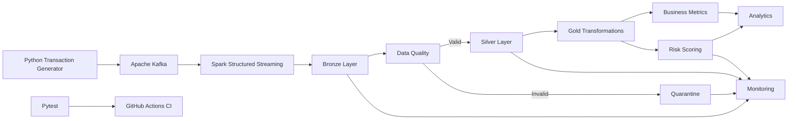

# Real-Time Financial Transaction Lakehouse

A production-style data engineering project that demonstrates real-time financial transaction ingestion, stream processing, Medallion Architecture, data-quality validation, analytics, risk scoring, monitoring, automated testing, and CI/CD.

The project simulates a financial transaction platform for the fictional company **NovaPay Financial**.

---

## Project Overview

Modern financial platforms generate large volumes of transaction events that must be processed reliably while preventing invalid or duplicate data from reaching downstream analytics.

This project implements an end-to-end transaction data pipeline using:

**Python → Apache Kafka → Spark Structured Streaming → Bronze → Data Quality → Silver / Quarantine → Gold Analytics → Risk Scoring → Monitoring**

The pipeline demonstrates practical data engineering concepts including event streaming, schema enforcement, data-quality controls, deduplication, layered lakehouse design, analytical transformations, monitoring, testing, and continuous integration.

---

## Architecture



Detailed architecture documentation is available in:

`architecture/architecture.md`

---

## Technology Stack

| Category | Technology |
|---|---|
| Programming | Python |
| Event Streaming | Apache Kafka |
| Stream Processing | Apache Spark Structured Streaming |
| Data Processing | PySpark |
| Storage Format | Apache Parquet |
| Architecture | Medallion Architecture |
| Data Layers | Bronze, Silver, Gold, Quarantine |
| Containerization | Docker / Docker Compose |
| Data Quality | PySpark validation rules |
| Testing | Pytest |
| Monitoring | Python + Spark |
| CI/CD | GitHub Actions |
| Version Control | Git / GitHub |
| Development | VS Code, WSL |

---

## Pipeline Flow

### 1. Synthetic Transaction Generation

The Python transaction generator creates realistic financial transaction events containing:

- Transaction ID
- Customer ID
- Account ID
- Merchant ID
- Merchant category
- Transaction type
- Amount
- Currency
- Payment method
- Country
- City
- Device type
- Transaction status
- Event timestamp

The generator intentionally introduces bad records and duplicate transaction IDs so the downstream data-quality layer can be tested.

The generated dataset contained:

```text
1,000 base transactions
+ 10 duplicate records
----------------------
1,010 total records
```

---

## 2. Apache Kafka Streaming

Transactions are published to the Kafka topic:

```text
financial-transactions
```

The topic uses three partitions.

A Python Kafka producer publishes JSON transaction events to the Kafka broker.

During the project execution:

```text
Messages published: 1,010
Successful:         1,010
Failed:             0
```

Kafka provides the event-streaming layer between transaction generation and Spark processing.

---

## 3. Spark Structured Streaming

Spark Structured Streaming consumes transaction events from Kafka.

The streaming pipeline captures both transaction data and Kafka metadata including:

- Kafka partition
- Kafka offset
- Kafka timestamp
- Ingestion timestamp

This metadata provides traceability between the source event stream and lakehouse records.

---

## 4. Bronze Layer

The Bronze layer stores the raw transaction events consumed from Kafka with minimal transformation.

Measured Bronze results:

```text
Records: 1,010
Columns: 18
```

The raw transaction values are preserved so data-quality issues can be identified downstream.

---

## 5. Data Quality

The data-quality pipeline validates transaction records before they enter the trusted Silver layer.

Validation includes checks for:

- Missing transaction IDs
- Missing customer IDs
- Missing amounts
- Non-positive amounts
- Invalid currencies
- Invalid statuses
- Missing or invalid timestamps
- Duplicate transaction IDs

Invalid records are separated from trusted records instead of silently discarded.

---

## 6. Silver and Quarantine Layers

Records that pass validation are standardized and deduplicated before being written to Silver.

Invalid records are written to the Quarantine layer with an error reason.

Measured results:

| Metric | Result |
|---|---:|
| Bronze records | 1,010 |
| Valid before deduplication | 959 |
| Invalid / quarantined | 51 |
| Valid duplicates removed | 9 |
| Final Silver records | 950 |
| Silver retention rate | 94.06% |
| Quarantine rate | 5.05% |

The Silver layer therefore contains **950 clean, deduplicated transactions** ready for downstream analytics.

---

## 7. Gold Analytics

The Gold layer converts clean Silver data into business-oriented analytical datasets.

Generated Gold datasets include:

```text
daily_transaction_metrics
merchant_transaction_metrics
country_transaction_metrics
payment_method_metrics
risk_scored_transactions
risk_summary
```

These datasets support reporting and analytical use cases without requiring consumers to repeatedly process raw transaction data.

---

## 8. Transaction Risk Scoring

The project includes a transparent rule-based transaction risk-scoring component.

Example rules include:

```text
Transaction amount > $5,000   → +30
Transaction outside US        → +20
Declined transaction          → +20
```

Risk categories:

```text
0–29   LOW
30–59  MEDIUM
60+    HIGH
```

Measured results across the 950 Silver transactions:

| Risk Level | Transactions |
|---|---:|
| LOW | 459 |
| MEDIUM | 475 |
| HIGH | 16 |
| **Total** | **950** |

This component demonstrates explainable transaction-risk processing. It is a rule-based scoring system rather than a trained fraud-detection machine-learning model.

---

## 9. Business Analytics Results

### Country Distribution

| Country | Transactions | Transaction Amount |
|---|---:|---:|
| US | 609 | $2,991,807.08 |
| CA | 123 | $614,570.16 |
| DE | 114 | $585,862.23 |
| GB | 104 | $541,464.96 |

### Payment Methods

| Payment Method | Transactions |
|---|---:|
| Credit Card | 246 |
| Digital Wallet | 237 |
| Debit Card | 237 |
| Bank Transfer | 230 |

Total processed Silver transaction value:

**$4,733,704.43**

---

## 10. Pipeline Monitoring

The monitoring component captures operational pipeline metrics and writes them to:

```text
monitoring/pipeline_metrics.json
```

Example measured monitoring results:

```json
{
    "status": "SUCCESS",
    "bronze_records": 1010,
    "silver_records": 950,
    "quarantined_records": 51,
    "records_removed_during_quality_processing": 9,
    "gold_risk_records": 950,
    "high_risk_transactions": 16,
    "medium_risk_transactions": 475,
    "low_risk_transactions": 459,
    "silver_retention_rate_percent": 94.06,
    "quarantine_rate_percent": 5.05
}
```

---

## 11. Automated Testing

The project includes automated PySpark tests covering important data-quality and business rules.

Test cases include:

```text
Valid transaction accepted
Negative amount rejected
Missing customer rejected
Invalid currency rejected
Duplicate transaction removed
High-value transaction receives elevated risk
```

Test execution result:

```text
6 passed
```

Run the test suite with:

```bash
python -m pytest tests/ -v
```

---

## 12. CI/CD

GitHub Actions provides continuous integration for the project.

For pushes and pull requests targeting the `main` branch, the workflow:

1. Checks out the repository
2. Configures Java 17
3. Configures Python 3.11
4. Installs project dependencies
5. Executes the automated PySpark test suite

Workflow configuration:

```text
.github/workflows/ci.yml
```

---

## Project Structure

```text
realtime-financial-transaction-lakehouse/
│
├── .github/
│   └── workflows/
│       └── ci.yml
│
├── architecture/
│   └── architecture.md
│
├── config/
├── dashboards/
├── docker/
├── docs/
├── monitoring/
│   ├── pipeline_monitor.py
│   └── pipeline_metrics.json
│
├── sql/
│
├── src/
│   ├── producer/
│   │   ├── transaction_generator.py
│   │   └── kafka_producer.py
│   │
│   ├── streaming/
│   │   ├── spark_test.py
│   │   ├── kafka_stream.py
│   │   └── bronze_stream.py
│   │
│   ├── quality/
│   │   ├── validate_transactions.py
│   │   └── rules.py
│   │
│   └── transformations/
│       └── gold_transform.py
│
├── tests/
│   └── test_quality_rules.py
│
├── docker-compose.yml
├── requirements.txt
├── .gitignore
└── README.md
```

---

## Local Setup

### Requirements

Install:

- Python 3.11+
- Java 17
- Docker
- Docker Compose
- Git

Clone the repository:

```bash
git clone <repository-url>
cd realtime-financial-transaction-lakehouse
```

Create a virtual environment and install dependencies:

```bash
python -m venv .venv
source .venv/bin/activate
pip install -r requirements.txt
```

---

## Start Kafka

Start the Kafka container:

```bash
docker compose up -d
```

Kafka runs locally on:

```text
localhost:9092
```

---

## Run the Pipeline

Generate synthetic transactions:

```bash
python src/producer/transaction_generator.py
```

Publish transactions to Kafka:

```bash
python src/producer/kafka_producer.py
```

Run Bronze streaming ingestion:

```bash
spark-submit \
  --packages org.apache.spark:spark-sql-kafka-0-10_2.13:4.2.0 \
  src/streaming/bronze_stream.py
```

Run data-quality processing:

```bash
python src/quality/validate_transactions.py
```

Run Gold transformations:

```bash
python src/transformations/gold_transform.py
```

Run pipeline monitoring:

```bash
python monitoring/pipeline_monitor.py
```

Run automated tests:

```bash
python -m pytest tests/ -v
```

---

## Key Engineering Concepts Demonstrated

This project demonstrates hands-on experience with:

- Real-time event-driven data pipelines
- Apache Kafka producers and consumers
- Spark Structured Streaming
- PySpark transformations
- Medallion Architecture
- Bronze / Silver / Gold data modeling
- Data-quality validation
- Quarantine patterns
- Transaction deduplication
- Apache Parquet
- Analytical aggregations
- Rule-based risk scoring
- Pipeline observability
- Automated PySpark testing
- Dockerized infrastructure
- GitHub Actions CI/CD
- Git-based software development

---

## Future Enhancements

Potential future extensions include:

- Databricks and Delta Lake
- Azure Data Lake Storage
- Azure Data Factory
- Delta Live Tables
- dbt transformations
- Apache Airflow orchestration
- Schema Registry
- Great Expectations
- Power BI dashboards
- Infrastructure as Code using Terraform
- ML-based anomaly or fraud detection

---

## Project Status

**Core local pipeline: Complete**

The project currently provides a working end-to-end local implementation from transaction generation through streaming ingestion, lakehouse processing, analytics, monitoring, testing, and CI configuration.

Cloud deployment and advanced orchestration are planned as future enhancements.