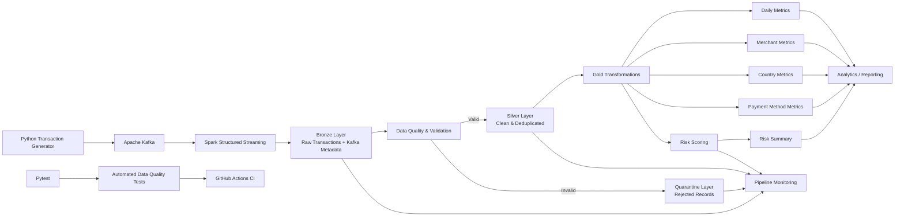

# NovaPay Financial Transaction Lakehouse — Architecture

## System Architecture

## Data Flow

The NovaPay pipeline simulates a real-time financial transaction processing architecture.

### 1. Transaction Generation

A Python-based synthetic data generator creates financial transactions containing customer, account, merchant, payment, location, device, status, and timestamp information.

The generator also intentionally introduces invalid records and duplicate transaction IDs so that data-quality controls can be demonstrated.

### 2. Apache Kafka

Transactions are published to the `financial-transactions` Kafka topic.

Kafka acts as the event-streaming layer between the transaction producer and downstream processing system.

### 3. Spark Structured Streaming

Apache Spark Structured Streaming consumes transaction events from Kafka.

Kafka metadata including partition, offset, and ingestion timestamp is preserved for traceability.

### 4. Bronze Layer

The Bronze layer stores raw transaction events with minimal transformation.

This provides an auditable representation of the data received from Kafka.

### 5. Data Quality

Data-quality rules validate transactions for conditions including:

- Missing transaction IDs
- Missing customer IDs
- Missing or invalid amounts
- Invalid currencies
- Invalid transaction statuses
- Missing or invalid timestamps
- Duplicate transaction IDs

### 6. Silver Layer

Valid transactions are standardized and deduplicated before being written to the Silver layer.

The Silver layer represents clean, analytics-ready transaction data.

### 7. Quarantine Layer

Transactions that fail validation rules are separated into the Quarantine layer with an error reason.

This prevents bad records from contaminating downstream analytics while preserving them for investigation.

### 8. Gold Layer

Gold transformations generate business-focused datasets including:

- Daily transaction metrics
- Merchant transaction metrics
- Country transaction metrics
- Payment method metrics
- Risk-scored transactions
- Risk summary

### 9. Transaction Risk Scoring

A transparent rule-based risk model assigns transaction risk scores using transaction amount, country, and transaction status.

Transactions are categorized as:

- LOW
- MEDIUM
- HIGH

The component demonstrates explainable risk-processing logic and is not presented as a trained fraud-detection model.

### 10. Monitoring

Pipeline monitoring captures operational metrics including Bronze, Silver, Quarantine, and Gold record counts, data-retention rates, quarantine rates, and risk distributions.

### 11. Automated Testing and CI

Pytest validates important data-quality and risk-scoring rules.

GitHub Actions automatically executes the test suite when code is pushed to the `main` branch or submitted through a pull request.